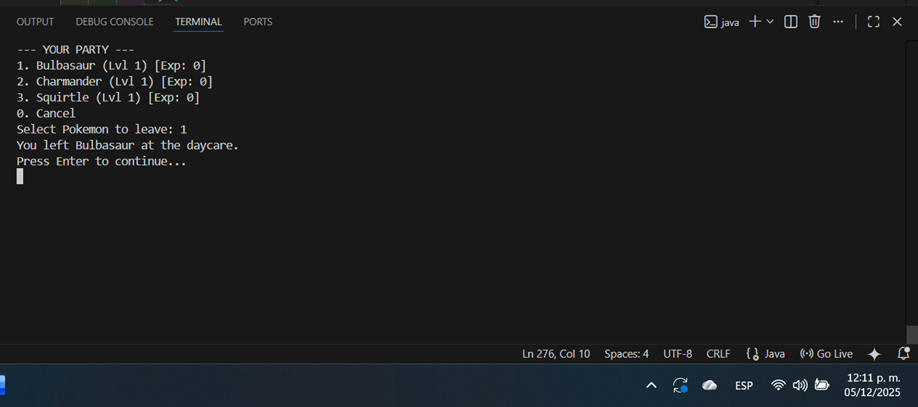
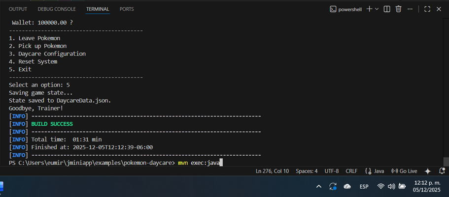
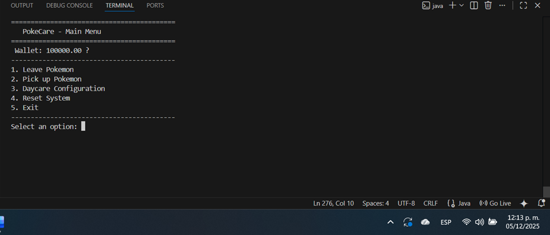
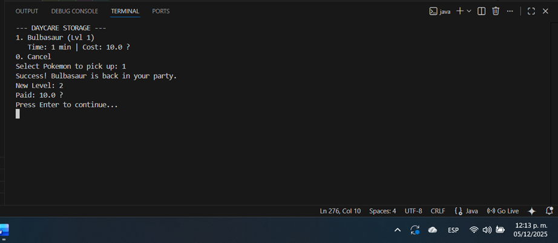
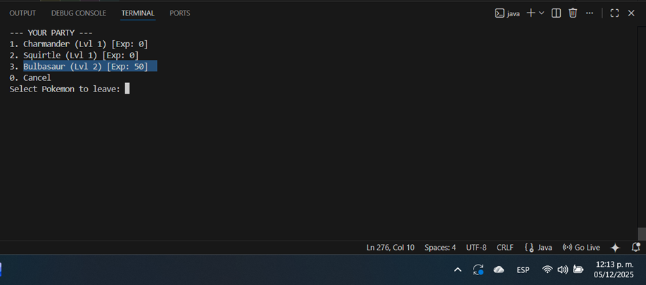

# Pokemon Daycare Example

A detailed simulation application demonstrating advanced state management, data persistence, and real-time calculations using the JMiniApp framework.

## Summary and Features

This application simulates a functional Pokemon Daycare. Trainers can leave up to three starter Pokemon (Bulbasaur, Charmander, and Squirtle) in care to gain experience over time. The system calculates the experience gained and the total cost to be charged based on the exact time elapsed between drop-off and pickup. Persistence is a key factor: progress and configuration are maintained even after closing and restarting the program

## Key features

- **Total persistence**: Daycare configuration, Trainer's wallet balance, and the state of all Pokemon are automatically saved between sessions.
- **Real-Time Growth Calculation**: Experience and cost are calculated based on the actual minutes elapsed outside the program.

- **Level Projection Upon Pickup**: When checking the pickup option, the system projects the Pokemon's current level and the total cost before confirming the transaction.

- **Level 10 Cap and Billing System**: Billing and experience gain automatically stop the moment the Pokemon reaches Level 10.

- **Inventory Management**: Allows moving Pokemon between the Trainer's Party and the Daycare Storage.

## Key system concepts

The system uses the `DaycareState` class as a single container for all game data, ensuring persistence.

### Lifecycle and Persistence

-  **Initialization**: Upon startup, the program attempts to load the `DaycareData.json` file. If the load is successful, the previous state is restored. If the file does not exist (or if "Reset System" is selected), `state.resetToDefaults()` is called to initialize the Trainer with 100,000 $ and the three starter Pokemon at Level 1.
-  **Shutdown**: Before exiting, the program calls `context.exportData()` which writes the complete `DaycareState` object to the `DaycareData.json` file, guaranteeing no data is lost.

### Growth and Billing Mechanics

The core logic resides in the methods `processGrowth(Pokemon p, long minutes)` and `calculateProjection(Pokemon original, long minutes)`.

- **Experience**: When a Pokemon is dropped off, the exact time is registered (`dropOffTimestamp`). Upon pickup, the elapsed time in minutes is calculated. Experience points are added incrementally, respecting the EXP requirement table per level (e.g., 50 exp for Lvl 2, 100 exp for Lvl 3, etc.).

- **Leveling Rule**: Upon leveling up, experience points reset to zero (or the excess is carried over to the next EXP bar), fulfilling the requirement.

- **Cost**: The cost is calculated based on the per-minute rate.

- **Level 10 Cap**: Both experience accumulation and cost calculation stop at the exact moment the Pokemon reaches Level 10.

## Project Structure

```
pokemon-daycare/
├── pom.xml
├── README.md
└── src/main/java/com/jminiapp/examples/daycare/
    ├── DaycareApp.java        # Main logic, menu, and time handling.
    ├── DaycareAppRunner.java  # Bootstrap configuration.
    ├── DaycareState.java      # Persistent data container (Config, Money, Pokemon).
    ├── Pokemon.java           # Pokemon model with leveling logic.
    └── DaycareJSONAdapter.java # Adapter for JSON persistence.
```

## Key Components

| Class                   | Function               | Responsibility                                                                                                                                              |
|------------------------|------------------------|-------------------------------------------------------------------------------------------------------------------------------------------------------------|
| `DaycareState.java`    | Global State Model     | Stores daycare configuration, Trainer's balance (`trainerMoney`), and Pokemon lists (Party and Daycare).                                                   |
| `Pokemon.java`         | Entity Model           | Manages name, level, current EXP, and drop-off timestamp. Contains the logic to calculate required EXP for the next level.                                 |
| `DaycareApp.java`      | Logic and Lifecycle    | Controls the menu flow, handles user input, performs time calculations, and manages billing/growth upon Pokemon pickup.                                     |
| `DaycareJSONAdapter.java` | Persistence Adapter | Implements `JSONAdapter<DaycareState>` to allow the framework to serialize/deserialize the complete `DaycareState` object.                                 |

## Usage Guide

### 1. Initial Configuration

- Upon startup, the program detects that isConfigured is false.

- You will be prompted for:

    - Daycare Name.

    - Cost per Minute ($).

    - EXP Growth per Minute.

### 2. Interaction Menu
Once configured, the system displays the main menu (along with the Trainer's current balance) and waits for an option:

## Menu Options

| Option              | Description                                                                                                                                                                                                 | Operation Detail                 |
|---------------------|-------------------------------------------------------------------------------------------------------------------------------------------------------------------------------------------------------------|----------------------------------|
| **1. Leave Pokemon** | Shows Pokémon in your party (Lvl 1 by default). Selecting one moves it to storage and registers the `dropOffTimestamp`.                                                                                     | —                                |
| **2. Pick up Pokemon** | Shows Pokémon in the daycare, along with their **Projected Level** and **Total Cost**. Pickup is only allowed if the balance is sufficient.                                                              | —                                |
| **3. Configuration** | Returns to the initial configuration (allows changing Name, Rate, and Growth).                                                                                                                             | —                                |
| **4. Reset System** | Calls `state.resetToDefaults()`. Resets the daycare config, Pokémon return to Level 1, and balance returns to **100,000 $**.                                                                                | `resetToDefaults()`              |
| **5. Exit**         | Executes `shutdown()`, saves the state to `DaycareData.json`, and closes the program.                                                                                                                       | `shutdown()`                     |

## Contruction and Execution

### Pre-requisites

- Java 17 or higher
- Maven 3.6 or higher

### 1. Project Compilation

From the **root** of the repository (jminiapp/):
```bash
mvn clean install
```

### 2. Application Execution

From the **example directory** (examples/pokemon-daycare):
```bash
cd examples/pokemon-daycare
mvn exec:java
```

## Application Gallery

The following space is reserved for the screenshots that demonstrate the application's workflow (Initial Configuration, Leaving a Pokemon, Waiting, Picking up a Pokemon, Successful Payment, and System Reset).

**Screenshot 1**  


**Screenshot 2**  


**Screenshot 3**  


**Screenshot 4**  


**Screenshot 5:**  


## Autor
eumirmanzanilla-beep

